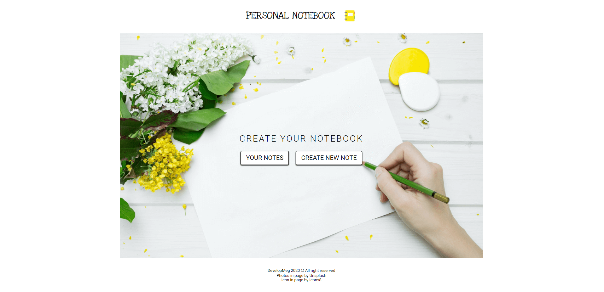
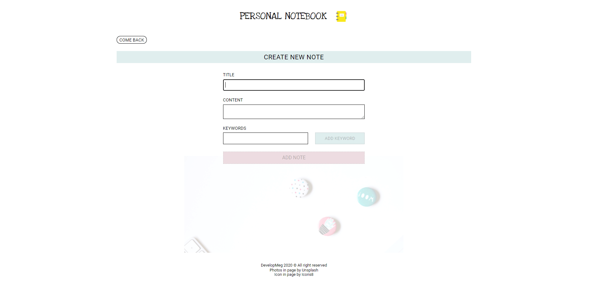
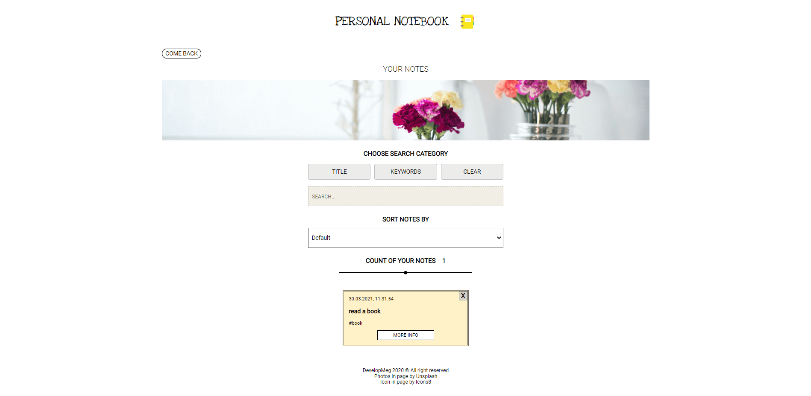

# personal-notebook

> This is my old project, but shows progress of my skills

#### This is an application, which let you save your notes

Link: https://developmeg.github.io/personal-notebook/

---

## Technologies

- React (Create React App)
- React Router
- Local Storage
- SCSS
- BEM

#### Extra Packages

- react-transition-group

## Installation

Clone this repository and install dependencies: `npm install`

Next run application on your localhost: `npm start`

To build project : `npm run build`
